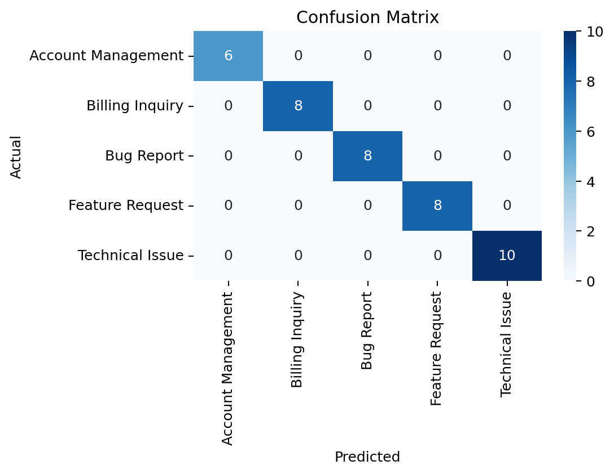

# Customer Support Ticket Auto‑Triage — REPORT

## Overview
This report summarizes the baseline text‑classification model trained on the synthetic customer support dataset (Subject + Description → Category). The model is served via a local FastAPI endpoint for real‑time classification and latency measurement.

## Dataset
- File: data/customer_support_tickets.csv  
- Target: Category (5 classes)  
- Text: Subject + Description (lowercased, minimal cleaning)

## Model
- Pipeline: TF‑IDF (1–2 grams, min_df=2, max_df=0.9, sublinear_tf) → LogisticRegression (liblinear, class_weight=balanced)  
- Artifact: models/ticket_model.joblib

## Final metrics (held‑out test split)
- Accuracy: 1.0
- Precision (macro): 1.0
- Recall (macro): 1.0
- F1 (macro): 1.0
- Avg latency per ticket (ms): 0.0649

> Source: reports/report.json  
> Note: The dataset is synthetic and clearly separable, so metrics are inflated compared to real‑world noisy tickets. Latency measured on this machine with the model preloaded.

## Confusion matrix

## Per‑class notes
- Strong separation across all five categories; no confusion observed in the held‑out split.  
- Vocabulary for Feature Request and Bug Report appears highly distinctive in the synthetic data.  
- Expect lower but still strong performance on real tickets after light normalization and regular retraining.

## API summary
- Endpoints: GET /health, GET /metadata, POST /predict, POST /predict_batch  
- Live testing: uvicorn api.app:app --reload and open http://127.0.0.1:8000 or /docs  
- Response includes predicted_category and latency_ms for real‑time validation.

## Next steps
- Add light normalization (optional stopwords/lemmatization) and small hyperparameter search.  
- Consider a compact Transformer baseline (e.g., DistilBERT) behind a flag for comparison, keeping the classical model as default for low latency.